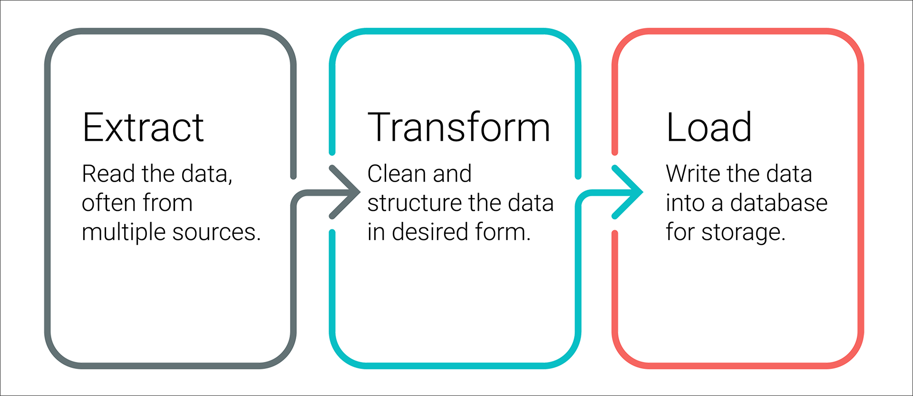

# Hack-a-thon Extract, Transfer & Load

For this project, data from both Wikipedia (web scraping) and Kaggle (csvs) were combined and saved into a SQL database so that hackathon participants had a nice, clean dataset
to use. To do this, the ETL process was completed: extract the Wikipedia and Kaggle data from their respective files, transform the datasets by cleaning them up and joining them 
together, and load the cleaned dataset into a SQL database.

Resources used to complete ETL:  Python, Pandas, Numpy, Jupyter Notebook, SQL, pgAdmin 4.4, PostgreSQL, wikipedia.movies.json, movies_metadata.csv, ratings.csv, git-lfs.exe

The extraction of the data was completed using webscraping to obtain a JSON file from Wikipedia (wikipedia.movies.json) and the csv files were downloaded from Kaggle
(movies_metadata.csv, ratings.csv).  The task of cleaning the data was initiated using a three step interative process:  Inspect, Plan, Execute

The JSON file is the least structured of our files, so cleaning with Python was started with eliminating unnecessary columns, keeping only those that contained information about 
a director (Director or Directed By columns) and a link to IMDB.  TV shows and duplicate rows were then eliminated from the dataset and multiple language columns were combined
into an alternate title column. 

Both the Wikipedia and the Kaggle data have an IMDB ID # which the datasets will be merged on.  Using regular expressions, the IMDB ID # was extracted from the IMDB link in the
Wikipedia dataset.  Box office figures and running time were also parsed using regular expressions.  This data cleaning process reduced the number of columns of the Wikipedia
dataset from 191 to an essential, useful number of 21.

The Kaggle dataset was a flat, structured file but still needed some cleaning.  Adult videos were removed from the data set and ratings data distribution was inspected.

At this time the Wikipedia and Kaggle datasets could be merged and then inspected for overlapping columns.  Comparing 7 similar columns, missing data was found more often in the
Wikipedia data than in the Kaggle data, and thus was either eliminated altogether or replaced with zeros.  A third dataset of ratings was processed to include a count of ratings
for each movie.  With this final step, we were ready to move on to the SQL database.

Using pgAdmin, we set up a PostgreSQL database and returned to our Jupyter Notebook, using sqlAlchemy to load our data into this database.  Because the ratings dataset was so 
large, we had to import it to the SQL database in "chunks," noting how many rows were imported so we can keep track of the progress of the loading process.

Finally, through refactoring the code in this ETL process, functions were created to automate this process for updating the 3 datasets in the future.

